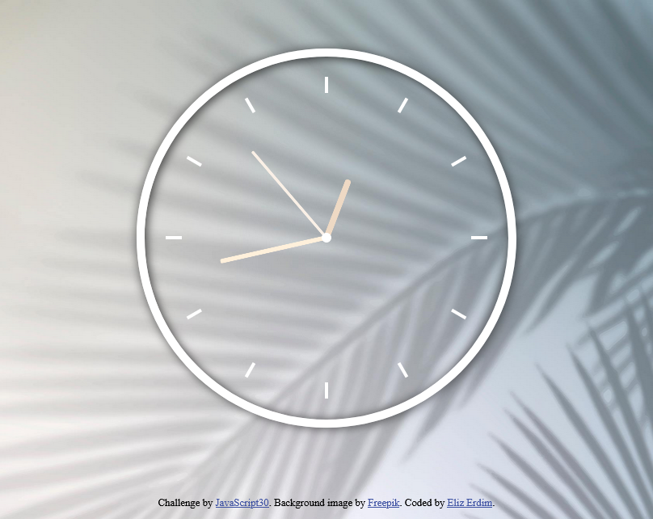

# JavaScript30 - JavaScript Clock

This is a solution to the JavaScript Clock challenge from Wes Bos's [30 Day Vanilla JS Coding Challenge](https://javascript30.com/).

## Table of contents

- [Overview](#overview)
  - [The challenge](#the-challenge)
  - [Screenshot](#screenshot)
  - [Links](#links)
- [My process](#my-process)
  - [Built with](#built-with)
  - [What I learned](#what-i-learned)
  - [Continued development](#continued-development)
  - [Useful resources](#useful-resources)

## Overview

### The challenge

- Create a functional clock using CSS and JavaScript.

### Screenshot

### Links

- [View Code](https://github.com/elizerdim/javascript-clock)
- [Live Preview](https://elizerdim.github.io/javascript-clock/)

## My process

### Built with

- Semantic HTML5 markup
- CSS3
- Flexbox
- JavaScript

### What I learned

In this project, I learned about the Date() constructor in JavaScript and how to use the getSeconds(), getMinutes(), and getHours() methods on its instance. I applied the values returned from these methods to the CSS transform property with rotate() function. 

This project also gave me plenty of opportunity to practice CSS as I made a lot of calculations with vw and vh units using calc() function to make the size of the clock responsive to the screen size, and used relative positioning and transform-origin for the rotate() function to put everything in place. 

I also learned about inset value of box-shadow property and how to use cubic-bezier in transition effects. In this project, I used cubic-bezier() function to make the hands of the clock move like the hands of a real analog clock.

### Continued development

I want to learn about other topics in DOM manipulation and improve my JavaScript skills through further projects before moving on to a framework like React.

### Useful resources

- [JavaScript Date() constructor](https://developer.mozilla.org/en-US/docs/Web/JavaScript/Reference/Global_Objects/Date/Date) - MDN's reference for Date() constructor in JavaScript.
- [cubic-bezier reference](https://developer.mozilla.org/en-US/docs/Web/CSS/easing-function) - MDN's reference for cubic-bezier.
- [cubic-bezier generator](https://cubic-bezier.com/#.17,.67,.83,.67) - Playing around with this generator helped me understand how cubic-bezier works with transition property to generate different effects.